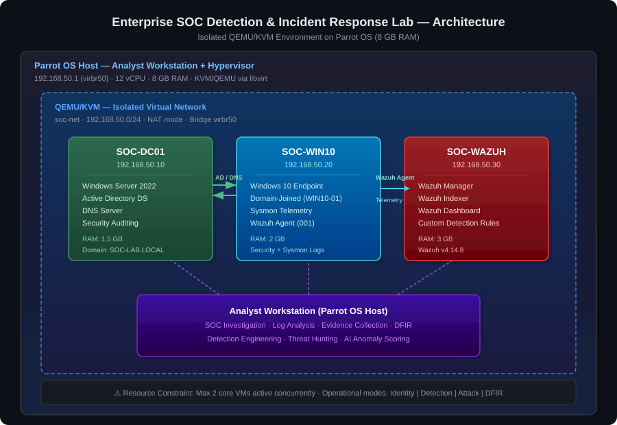
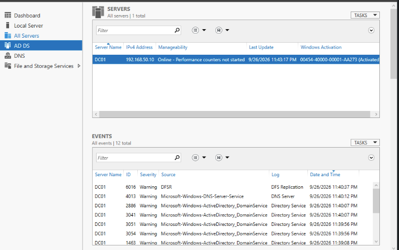
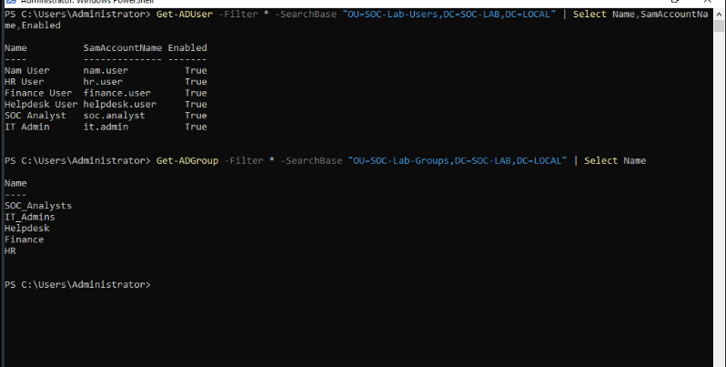
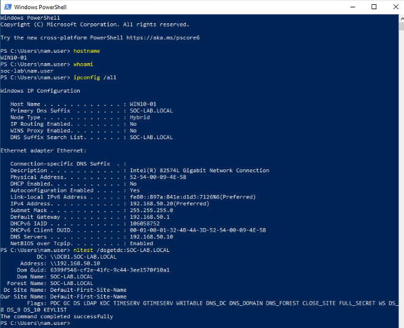
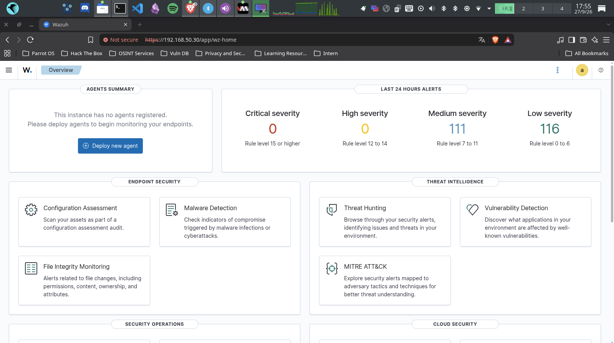
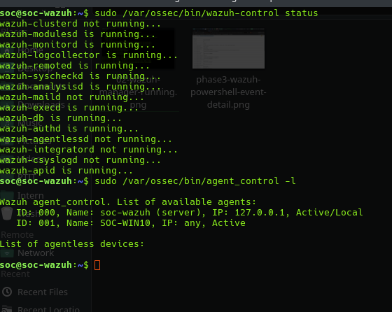
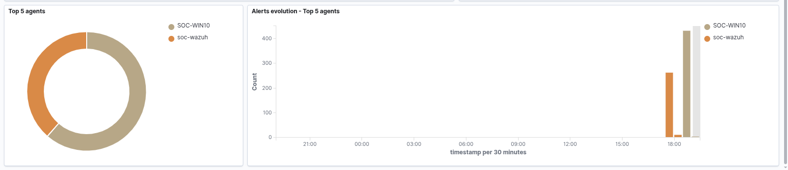
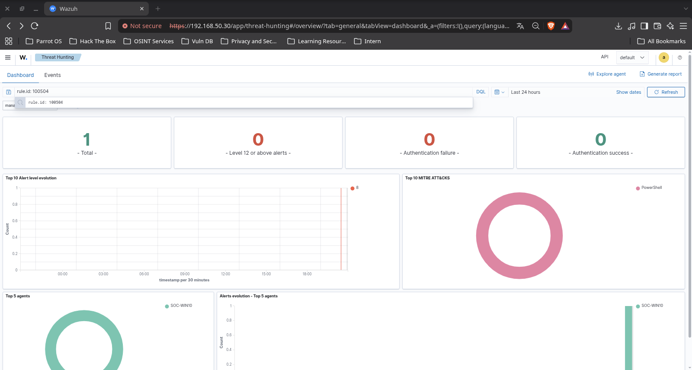
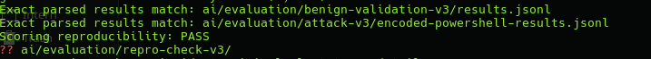

# Enterprise SOC Detection & Incident Response Lab

*An evidence-driven Windows SOC home lab demonstrating endpoint telemetry, detection engineering, alert triage, threat hunting, digital forensics, incident response, and detection tuning — built and operated on an 8 GB Parrot OS host.*


---

## Table of Contents

- [Project Overview](#project-overview)
- [Key Highlights](#key-highlights)
- [SOC Architecture](#soc-architecture)
- [SOC Investigation Workflow](#soc-investigation-workflow)
- [Technology Stack](#technology-stack)
- [Detection Engineering](#detection-engineering)
- [Alert Triage & Threat Hunting](#alert-triage--threat-hunting)
- [Incident Response Case Studies](#incident-response-case-studies)
- [Digital Forensics & Investigation](#digital-forensics--investigation)
- [Incident Response & Recovery](#incident-response--recovery)
- [AI Anomaly Detection — Experimental](#ai-anomaly-detection--experimental)
- [Evidence Gallery](#evidence-gallery)
- [Reproducibility](#reproducibility)
- [Repository Structure](#repository-structure)
- [Lessons Learned](#lessons-learned)
- [Limitations & Future Improvements](#limitations--future-improvements)
- [Security & Ethics](#security--ethics)

---

## Project Overview

### Why This Lab Exists

SOC analysts must demonstrate more than theoretical knowledge — they need to show they can investigate real telemetry, validate detections, reason through evidence, and clearly communicate findings. This lab provides a controlled environment to practice and document those skills end-to-end.

### What This Lab Demonstrates

This project implements a complete Windows SOC investigation workflow within a resource-constrained home lab:

1. **Build** an Active Directory domain environment with endpoint telemetry.
2. **Collect** Windows Security and Sysmon events through Wazuh.
3. **Detect** suspicious behaviors with custom Wazuh rules mapped to MITRE ATT&CK.
4. **Investigate** alerts through structured triage and threat hunting.
5. **Respond** to simulated incidents with process containment, account management, and recovery verification.
6. **Tune** detection rules using evidence-driven false positive analysis.
7. **Document** every finding with SHA-256 verified evidence and honest limitations.

### Design Constraints

The lab runs on a single Parrot OS laptop with 8 GB RAM using QEMU/KVM. A maximum of two core VMs operate concurrently, managed through [resource operating modes](architecture/resource-modes.md). This constraint is intentional — it reflects realistic conditions for students and demonstrates resource-aware security operations.

> **Note:** This is an educational home lab. No production SOC readiness, real compromise, or 100% detection accuracy is claimed. All attack simulations are authorized, controlled lab activity.

---

## Key Highlights

| # | Capability | Evidence |
|---|---|---|
| 1 | **Windows domain environment** with AD DS, DNS, domain-joined endpoint, and Sysmon telemetry | [Architecture](architecture/topology.md) · [IP Plan](architecture/ip-plan.md) |
| 2 | **6 custom Wazuh detection rules** mapped to MITRE ATT&CK, validated through live testing | [Detection rules](configs/wazuh/rules/local_rules.xml) · [Live test results](detections/wazuh/tests/encoded-powershell/README.md) |
| 3 | **4 structured threat hunts** covering PowerShell, authentication, WinRM, and persistence | [Hunting reports](hunting/README.md) · [MITRE coverage](hunting/MITRE-COVERAGE.md) |
| 4 | **2 incident case studies** — controlled investigation (SOC-INC-001) and detection tuning (INC-002) | [SOC-INC-001](incidents/SOC-INC-001/capstone-report.md) · [INC-002](incidents/INC-002-wazuh-fp-tuning/triage-report.md) |
| 5 | **DFIR investigation & artifact acquisition** — Python timeline reconstruction (DFIR-001) and native EVTX/Prefetch collection with Sysmon corroboration (DFIR-002) | [DFIR-001](dfir/cases/DFIR-001/investigation-report.md) · [DFIR-002](dfir/cases/DFIR-002/README.md) |
| 6 | **17/17 evidence artifacts** passed SHA-256 verification across 5 independent manifests for SOC-INC-001 | [Capstone report](incidents/SOC-INC-001/capstone-report.md) · [Closure assessment](incidents/SOC-INC-001/closure-assessment.md) |

---

## SOC Architecture

<p align="center">
  
</p>

### Infrastructure

| Component | Hostname | Role | IP Address | RAM |
|---|---|---|---|---|
| **SOC-DC01** | DC01 | Windows Server 2022 — Active Directory DS + DNS | 192.168.50.10 | 1.5 GB |
| **SOC-WIN10** | WIN10-01 | Windows 10 — Domain-joined endpoint, Sysmon, Wazuh Agent | 192.168.50.20 | 2 GB |
| **SOC-WAZUH** | — | Wazuh Manager, Indexer, and Dashboard (v4.14.8) | 192.168.50.30 | 3 GB |
| **Parrot OS** | — | Hypervisor host, analyst workstation, NAT gateway | 192.168.50.1 | Host OS |

**Network:** Isolated libvirt NAT network [`soc-net`](soc-net.xml) on `192.168.50.0/24` via bridge `virbr50`.
**Domain:** `SOC-LAB.LOCAL`.

### Resource Operating Modes

Due to 8 GB RAM constraints, VMs are rotated across [four operating modes](architecture/resource-modes.md):

| Mode | Active VMs | Purpose |
|---|---|---|
| Identity | SOC-DC01 + SOC-WIN10 | AD operations, domain join, authentication logs |
| Detection | SOC-WIN10 + SOC-WAZUH | Wazuh ingestion, detection testing, dashboards |
| Attack | SOC-WIN10 + SOC-WAZUH or SOC-DC01 | Controlled telemetry generation |
| DFIR | One Windows VM + Parrot | Timeline analysis, evidence collection |

---

## SOC Investigation Workflow

The following diagram shows the end-to-end SOC workflow implemented in this lab. Steps marked with ✅ are validated with evidence; ⚠️ indicates partially validated steps.

```mermaid
flowchart LR
    A["✅ Endpoint<br/>Activity"] --> B["✅ Sysmon +<br/>Windows Events"]
    B --> C["✅ Wazuh Agent<br/>Collection"]
    C --> D["✅ Custom<br/>Detection Rules"]
    D --> E["✅ Alert<br/>Triage"]
    E --> F["✅ Threat<br/>Hunting"]
    F --> G["✅ DFIR &<br/>Timeline"]
    G --> H["⚠️ Containment<br/>& Recovery"]
    H --> I["✅ Detection<br/>Tuning"]

    style A fill:#2d6a4f,stroke:#40916c,color:#fff
    style B fill:#2d6a4f,stroke:#40916c,color:#fff
    style C fill:#2d6a4f,stroke:#40916c,color:#fff
    style D fill:#2d6a4f,stroke:#40916c,color:#fff
    style E fill:#2d6a4f,stroke:#40916c,color:#fff
    style F fill:#2d6a4f,stroke:#40916c,color:#fff
    style G fill:#2d6a4f,stroke:#40916c,color:#fff
    style H fill:#e9c46a,stroke:#f4a261,color:#000
    style I fill:#2d6a4f,stroke:#40916c,color:#fff
```



**Containment & Recovery** is marked partially validated because: process termination and AD account disable/restore are verified, but Sysmon Event 5 termination telemetry, session revocation, and complete application recovery remain unverified.

---

## Technology Stack

| Category | Tools | Evidence |
|---|---|---|
| **Virtualization** | QEMU/KVM, libvirt, Parrot OS | [Host baseline](evidence/phase0-host-baseline.txt) |
| **Identity & Infrastructure** | Windows Server 2022, Active Directory DS, DNS | [Phase 1 screenshots](screenshots/phase1-dc01/) |
| **Endpoint Telemetry** | Sysmon (Event IDs 1, 3, 5, 11, 13), Windows Security Events | [Wazuh collection config](screenshots/phase2-wazuh/05-sysmon-wazuh-collection-config.png) |
| **SIEM & Detection** | Wazuh v4.14.8 (Manager, Indexer, Dashboard), custom XML rules | [Custom rules](configs/wazuh/rules/local_rules.xml) |
| **Threat Hunting** | Hypothesis-driven hunts, Wazuh query, event correlation | [Hunt reports](hunting/README.md) |
| **DFIR & Integrity** | Python pipeline, native Windows EVTX/Prefetch acquisition, SHA-256 manifests, JSON Schema | [DFIR cases](dfir/cases/) · [Scripts](dfir/scripts/) |
| **AI / Anomaly Detection** | scikit-learn Isolation Forest, pandas, numpy | [AI pipeline](ai/README.md) |
| **Version Control** | Git with `.gitattributes` for binary preservation | [Repository](.) |

---

## Detection Engineering

### Custom Wazuh Detection Rules

Core Wazuh custom rules are maintained in [`configs/wazuh/rules/local_rules.xml`](configs/wazuh/rules/local_rules.xml). The independently documented AD-001 detection is available as [Rule 100506](detections/wazuh/rules/100506-ad-enumeration.xml).

| Rule ID | Level | Detection Use Case | Telemetry Source | MITRE ATT&CK | Validation Status | Evidence |
|---|---|---|---|---|---|---|
| 100501 | 7 | Registry Run Key modification | Sysmon Event 13 | [T1112](https://attack.mitre.org/techniques/T1112/) / [T1547.001](https://attack.mitre.org/techniques/T1547/001/) | ✅ Validated | [HUNT-004](hunting/HUNT-004-persistence.md) · [SOC-INC-001](incidents/SOC-INC-001/timeline.md) |
| 100502 | 8 | WinRM process execution | Sysmon Event 1 | [T1021.006](https://attack.mitre.org/techniques/T1021/006/) | ✅ Validated | [HUNT-003](hunting/HUNT-003-winrm.md) · [SOC-INC-001](incidents/SOC-INC-001/timeline.md) |
| 100503 | 10 | Repeated failed logons (5 in 60s) | Windows Event 4625 | [T1110](https://attack.mitre.org/techniques/T1110/) | ✅ Validated | [HUNT-002](hunting/HUNT-002-authentication.md) |
| 100504 | 8 | Encoded PowerShell command | Sysmon Event 1 | [T1059.001](https://attack.mitre.org/techniques/T1059/001/) | ✅ Validated | [HUNT-001](hunting/HUNT-001-powershell.md) · [Live tests](detections/wazuh/tests/encoded-powershell/README.md) |
| 100505 | 7 | PowerShell network connection to lab target | Sysmon Event 3 | [T1095](https://attack.mitre.org/techniques/T1095/) | ⚠️ Partially | Independently validated; excluded from SOC-INC-001 due to missing Event 3 |
| 100506 | 3 | PowerShell AD enumeration (`Get-ADUser`, `Get-ADGroup`, `Get-ADGroupMember`) | PowerShell Event 4104 | [T1087.002](https://attack.mitre.org/techniques/T1087/002/) | ✅ Live regression 2/2 | [AD-001 Case Study](ad-labs/AD-001-domain-enumeration/README.md) · [Rule XML](detections/wazuh/rules/100506-ad-enumeration.xml) · [Evidence](evidence/ad-001/AD001-regression-20261009.json) |
| 100001 | 3 | WebView2 Speech DLL severity reduction | Sysmon Event 11 | — | ⚠️ Partially | [INC-002](incidents/INC-002-wazuh-fp-tuning/triage-report.md) (PS tests pass; live WebView2 unverified) |

### AD-001 — Active Directory Enumeration Detection

**Completed 2026-10-09:** SOC-DC01 PowerShell Event 4104 was
collected by Wazuh Agent 002 and detected by custom Rule 100506.

- **Positive control:** `Get-ADUser` → Event Record 832 → Alert 100506.
- **Negative control:** `Get-Date` → Event Record 837 → no Alert 100506.
- **Regression:** 2/2 controlled live test cases passed.
- **Tuning:** Investigated a Rule Matching Gap and resolved it
  by inheriting from built-in PowerShell Rule 91802.
- **Limitations:** Only `Get-ADUser` was positively tested;
  the result does not establish production detection accuracy.

[Read the AD-001 Detection Engineering Case Study](ad-labs/AD-001-domain-enumeration/README.md).

### Detection Logic Summary

**Rule 100504 — Encoded PowerShell** (example):

```xml
<rule id="100504" level="8">
  <if_sid>61603</if_sid>
  <field name="win.eventdata.image" type="pcre2">(?i)powershell\.exe$</field>
  <field name="win.eventdata.commandLine" type="pcre2">(?i)(?:-EncodedCommand|-enc(?:\s|$))</field>
  <description>SOC Lab: Encoded PowerShell command detected</description>
  <mitre>
    <id>T1059.001</id>
  </mitre>
</rule>
```

- **Hypothesis:** PowerShell with `-EncodedCommand` or `-enc` flags may indicate obfuscated execution.
- **Critical fields:** `win.eventdata.image`, `win.eventdata.commandLine`, parent process context.
- **False positive consideration:** Legitimate automation may use encoded commands. Parent process and decoded payload content are required for triage.

### Live Detection Validation Results

| Test | Behavior | Observed Rule / Level | Result |
|---|---|---|---|
| T01 | PowerShell parent, `-EncodedCommand` | 92057 / 12 | ✅ PASS |
| T02 | CMD parent, `-EncodedCommand` | 100504 / 8 | ✅ PASS |
| T03 | CMD parent, `-enc` | 100504 / 8 | ✅ PASS |
| T04 | PowerShell parent, ordinary `-Command` | 92027 / 4 | ✅ PASS (negative control) |

Full test methodology, correlation evidence, and integrity checks: [Encoded PowerShell Validation](detections/wazuh/tests/encoded-powershell/README.md).

---

## Alert Triage & Threat Hunting

### Triage Methodology

```
Alert → Raw Event Fields → Host / User Context → Process Tree
  → Related Events → Scope Assessment → Verdict
```

Every alert was investigated using:
- The underlying Sysmon or Windows Security event (not just the Wazuh alert summary).
- Parent process identification to establish execution context.
- User account and endpoint correlation.
- Decoded payload analysis where applicable (e.g., Base64 PowerShell).
- MITRE ATT&CK mapping to frame the observed behavior.

### Threat Hunting Matrix

All hunts follow: **Hypothesis → Telemetry Search → Evidence → Finding → Detection Opportunity**.

| Hunt | Hypothesis | Data Source | MITRE ATT&CK | Key Finding | Detection Rule | Report |
|---|---|---|---|---|---|---|
| HUNT-001 | Encoded PowerShell may evade basic detection | Sysmon EID 1 | T1059.001 | Built-in 92057 catches PS-parented; custom 100504 catches CMD-parented encoded commands | 100504 | [Report](hunting/HUNT-001-powershell.md) |
| HUNT-002 | Repeated auth failures indicate brute force or misconfiguration | Windows EID 4625/4624 | T1110 | Successful and failed logons for different accounts do not establish a compromise chain | 100503 | [Report](hunting/HUNT-002-authentication.md) |
| HUNT-003 | WinRM child processes indicate remote execution | Sysmon EID 1 | T1021.006 | Original rule depended on cmd.exe-specific parent; improved to detect any `wsmprovhost.exe` child | 100502 | [Report](hunting/HUNT-003-winrm.md) |
| HUNT-004 | Registry Run Key modifications may indicate persistence | Sysmon EID 13 | T1112 / T1547.001 | Both legitimate Edge autostart and controlled persistence trigger the same rule — **Alert ≠ Incident** | 100501 | [Report](hunting/HUNT-004-persistence.md) |

Evidence exports for each hunt: [`hunting/evidence/`](hunting/evidence/).
MITRE ATT&CK coverage matrix: [`hunting/MITRE-COVERAGE.md`](hunting/MITRE-COVERAGE.md).

---

## Incident Response Case Studies

### SOC-INC-001 — Controlled WinRM / Encoded PowerShell / Registry Persistence Investigation

**Context:** On 2026-09-29, a controlled simulation on SOC-WIN10 generated WinRM remote execution, encoded PowerShell, and a Registry Run Key modification under `SOC-LAB\nam.user`. Separate response exercises were performed on 2026-10-07 and 2026-10-08.

> **Important:** The September simulation and October response exercises are documented separately with independent timestamps and evidence. They are not presented as one continuous incident.

#### Incident Timeline (September 29 Simulation)

| Timestamp (UTC) | Rule | Level | Event | Observation |
|---|---|---|---|---|
| 14:25:06 | 100502 | 8 | Sysmon EID 1 | `cmd.exe` spawned through WinRM (`wsmprovhost.exe` parent) |
| 14:26:37 | 100504 | 8 | Sysmon EID 1 | Encoded PowerShell with `-EncodedCommand` (decoded: `Write-Output 'SOC-INC-001-ENCODED-PS'`) |
| 14:34:07 | 100501 | 7 | Sysmon EID 13 | Registry Run Key `SOC-INC-001` created under `HKCU\...\Run` |

**Correlation factors:** Same endpoint, same account, 9-minute window, WinRM process context, explicit lab markers.
**Verdict:** Authorized controlled lab activity. No real compromise established.
**Network gap:** An attempted connection to `192.168.50.30:55000` was excluded from the confirmed timeline because matching Sysmon Event 3 was not observed.

#### Response Exercises (October 7–8, Separate)

| Exercise | Verified Result | Evidence |
|---|---|---|
| Process containment replay | Target PID absent after `Stop-Process` | [Response replay](incidents/SOC-INC-001/response-replay.md) |
| AD account disable | Disabled state verified; Event 4725 corroborated | [Account response](incidents/SOC-INC-001/account-response.md) |
| AD account restore | Enabled state restored; Event 4722 corroborated | [Account response](incidents/SOC-INC-001/account-response.md) |
| Run Key current-state check | SOC-INC-001 value absent from target user SID | [Recovery verification](incidents/SOC-INC-001/recovery-verification.md) |
| Sampled monitoring | 11 samples over ~5m14s: value absent, Sysmon/Wazuh services running | [Recovery verification](incidents/SOC-INC-001/recovery-verification.md) |
| Post-restoration auth | Successful Kerberos TGT, process under target SID | [Recovery verification](incidents/SOC-INC-001/recovery-verification.md) |
| Desktop/profile recovery | Observed desktop session, DC Kerberos auth, profile file readback | [Recovery verification](incidents/SOC-INC-001/recovery-verification.md) |

**Unverified:** Sysmon Event 5 termination telemetry, historical Run Key deletion time/actor, session revocation, complete application recovery.

#### Evidence Integrity

**17 evidence artifacts** passed SHA-256 verification across **5 independent manifests**. Transferred hashes matched source values and staged Git bytes were verified. This establishes integrity of the collected evidence at transfer time — it does not establish original acquisition-time hashing or complete chain of custody.

Full case documentation: [Capstone Report](incidents/SOC-INC-001/capstone-report.md) · [Analysis](incidents/SOC-INC-001/analysis.md) · [Timeline](incidents/SOC-INC-001/timeline.md) · [Closure Assessment](incidents/SOC-INC-001/closure-assessment.md)

---

### INC-002 — Wazuh WebView2 False Positive Tuning

**Context:** A Wazuh level 15 alert (rule 92213) was generated when `msedgewebview2.exe` created a Speech DLL in a temporary unpacking directory. Investigation determined this was likely benign WebView2 activity, but the original severity reduction rule (100001) was overly broad.

#### Investigation and Tuning

| Phase | Finding |
|---|---|
| **Initial detection issue** | The original rule 100001 reduced severity whenever `msedgewebview2.exe` appeared in *any* target filename — including PowerShell-created files |
| **Root-cause analysis** | Correlated Sysmon Event 11 (file creation) with Event 1 (process creation) via ProcessGuid; traced parent to `M365Copilot.exe`; verified WebView2 executable Authenticode signature |
| **New detection predicate** | Narrowed rule 100001 to require both the versioned WebView2 executable path *and* the specific Speech DLL unpacking pattern |
| **Live before/after** | PowerShell-created file with `msedgewebview2.exe` in name: **Before** 100001/level 3 → **After** 92213/level 15 ✅ |
| **Control test** | `control.dll` remained at 92213/level 15 in both before and after ✅ |
| **Remaining gap** | Live WebView2-originated event has not yet triggered the intended level 3 reduction branch — predicate tests and adapted historical replay passed, but live validation is **unverified** |

Full report: [INC-002 Triage and Tuning](incidents/INC-002-wazuh-fp-tuning/triage-report.md).

---

### Archived Detection Evidence Regression v1

Four controlled encoded PowerShell test cases (T01–T04) were
verified against archived Wazuh alerts, archive records, and execution
metadata, with a 4/4 PASS result and 14/14 fixture SHA-256 matches.

This is **archived evidence verification**, not a re-execution
of the current Wazuh ruleset. Rule-level regression for 100503,
100505 and the other custom rules remains pending.

Evidence: [Regression Matrix](detections/wazuh/regression/regression-matrix.md)
· [Test Report](detections/wazuh/regression/test-report.md)
· [Verification Runner](detections/wazuh/regression/verify_archived_evidence.py).

## Digital Forensics & Investigation

### DFIR-001 — Controlled Hunting Evidence Investigation

DFIR-001 reviews evidence from the four threat hunting exercises using a Python-automated pipeline:

**Pipeline:** `build_timeline.py` → `export_timeline.py` → `verify_case.py`

| Component | Details |
|---|---|
| **Source records** | 10 Wazuh event exports from HUNT-001 through HUNT-004 |
| **Timeline formats** | JSONL, CSV, and Markdown |
| **Schema validation** | JSON Schema with `jsonschema` library |
| **Integrity verification** | SHA-256 manifest covering 10 sources + 3 derived timelines |
| **Timeline rebuild** | Matched existing manifest on 2026-10-07 |

#### Verified Event Timeline (Sample)

| Wazuh Timestamp | Hunt | Rule | Event | User | Summary |
|---|---|---|---|---|---|
| 2026-09-30T01:01:29 | HUNT-001 | 100504 | EID 1 | localadmin | Encoded PowerShell execution |
| 2026-09-30T01:55:25 | HUNT-002 | 100503 | EID 4625 | hunt002-test | Repeated failed authentication |
| 2026-09-30T04:27:00 | HUNT-003 | 100502 | EID 1 | nam.user | WinRM child process execution |
| 2026-09-30T04:53:24 | HUNT-004 | 100501 | EID 13 | nam.user | Registry Run Key modification |

> **Important:** These are independent controlled hunting exercises, not a single attack chain. Multiple stored exports may describe the same underlying event.

**Limitations:** No independent EVTX, memory, or disk acquisition is demonstrated. Timeline sorting uses the preserved Wazuh timestamp. Original acquisition-time hashing is not established.

Full report: [DFIR-001 Investigation](dfir/cases/DFIR-001/investigation-report.md) · [Evidence Manifest](dfir/cases/DFIR-001/evidence-manifest.md).

### DFIR-002 — Windows Endpoint Artifact Acquisition & Native Corroboration

DFIR-002 expands the lab's forensic scope from log export parsing to live logical artifact collection directly on the domain endpoint **SOC-WIN10 (WIN10-01)**, verifying artifact integrity, and corroborating historical hunting alerts against native Windows event logs.

#### Forensic Acquisition & Verification Summary

| Artifact Group | Scope & Metrics | Collection Method | Verification Result | Status |
|---|---|---|---|---|
| **Native EVTX Logs** | 3 channels: Security (13.7 MB), Sysmon-Operational (25.2 MB), PowerShell-Operational (15.8 MB) | `wevtutil.exe export-log` via elevated PowerShell | `Get-WinEvent` readback passed; SHA-256 matched | ✅ PASS (3/3) |
| **Prefetch Files** | 255 `.pf` files from `C:\Windows\Prefetch` (~5.09 MB) | Logical file collection (`Copy-Item`) | Post-collection SHA-256 check: 255/255 passed | ✅ PASS (255/255) |
| **Aggregate Evidence Manifest** | 261 files (3 EVTX + 255 Prefetch + 1 metadata JSON + 2 CSV manifests) | Directory-wide SHA-256 computation (`SHA256SUMS.txt`) | Zero hash mismatches against recorded manifest | ✅ PASS (261/261) |
| **Amcache Hive** | `C:\Windows\AppCompat\Programs\Amcache.hve` (~2.36 MB) | Direct file copy | Failed due to active OS file lock; no VSS snapshot taken | ❌ FAILED (Known gap) |

#### Native Sysmon Corroboration of Historical Hunts

Using the acquired `Sysmon-Operational.evtx`, historical hunting records from DFIR-001 were independently corroborated against the endpoint's native event stream:

| Corroboration Target | Native Sysmon Record ID | Event ID & Details | ProcessGuid Match | Corroboration Outcome |
|---|---|---|---|---|
| **HUNT-003** (WinRM Process) | Record ID 7366 | Event ID 1 (`ProcessCreate`): `cmd.exe` spawned by `wsmprovhost.exe` | `{e12a69d9-8f92-6abc-6001-000000001500}` | ✅ Confirmed native event record |
| **HUNT-004** (Persistence Run Key) | Record ID 7380 | Event ID 13 (`RegistryEvent`): User Run key modified with `HUNT004-RUNKEY-VALIDATION` | `{e12a69d9-95ba-6abc-7101-000000001500}` | ✅ Confirmed native event record |

Derived analysis artifact: `native-correlation.json` (SHA-256: `A9C52CF34F81A5E6C6C784989578D987C1871ED907FB46ED0E1B3D97776C508B`).

> **Forensic Context & Non-Attribution:** Native Sysmon records for HUNT-003 and HUNT-004 were corroborated against the preserved SIEM hunting records using Event ID, Record ID, and ProcessGuid. This supports these two specific historical observations but does not independently establish the integrity of all SIEM alerts or the full chain of custody. However, corroborating these two independent hunting records **does not** prove an active adversary compromise, persistence execution, or a continuous end-to-end attack chain.

#### Acquisition Boundaries & Storage
- **Live logical collection:** Artifacts were acquired from a running system using native tooling, not via dead-box forensic disk imaging or memory dump.
- **Amcache limitation:** Live file locks prevented direct acquisition; Volume Shadow Copy Service (VSS) was present but had no pre-existing snapshots and no snapshot was generated during collection.
- **Public repository boundary:** Raw EVTX and Prefetch binaries (~54 MB) are retained on the acquisition endpoint to prevent sensitive data exposure; all findings are documented via structured reports and SHA-256 checksum manifests.

Full case documentation: [DFIR-002 Overview](dfir/cases/DFIR-002/README.md) · [Acquisition Report](dfir/cases/DFIR-002/acquisition-report.md) · [Correlation Report](dfir/cases/DFIR-002/correlation-report.md) · [Evidence Manifest](dfir/cases/DFIR-002/evidence-manifest.md).

---

## Incident Response & Recovery

The following response exercises were performed **separately** from the original SOC-INC-001 simulation. Each exercise includes pre-action identity verification and post-action state checks.

### Verified Response Actions

| Action | Method | Verification | Result |
|---|---|---|---|
| **Process termination** | `Stop-Process` on PID 7380 (encoded PS) | Post-termination PID query: absent | ✅ PASS |
| **AD account disable** | `Disable-ADAccount` on `nam.user` | `Enabled=False` + Security Event 4725 | ✅ PASS |
| **AD account restore** | `Enable-ADAccount` on `nam.user` | `Enabled=True` + Security Event 4722 | ✅ PASS |
| **Run Key verification** | Registry query under target user SID | SOC-INC-001 value: absent | ✅ PASS |
| **Sampled monitoring** | 11 checks over ~5m14s | Value absent, Sysmon/Wazuh running at each sample | ✅ PASS |
| **Agent status check** | Wazuh manager query | Agent 001 (SOC-WIN10): Active | ✅ PASS |
| **Domain auth recovery** | `runas` → Kerberos TGT (DC Event 4768) | Process created under target SID | ✅ PASS |
| **Desktop/profile test** | Console session, file create/readback | Expected SID, profile path, file content matched | ✅ PASS |

### Not Yet Verified

| Action | Status |
|---|---|
| Sysmon Event 5 process termination telemetry | Not found in Event 5 query |
| Historical Run Key deletion time and actor | Unknown |
| Authentication blocking while account disabled | Not tested |
| Session/ticket revocation | Not tested |
| Complete application recovery | Not established |

These exercises demonstrate **individual response capabilities**, not complete enterprise incident closure. The sampled monitoring window is accepted for the educational exercise scope.

---

## AI Anomaly Detection — Experimental

> **This is an experimental auxiliary analytics component, not a validated replacement for rule-based detection.**

### Isolation Forest v3

The experiment uses an unsupervised Isolation Forest model trained on Windows telemetry to score events for statistical unusualness.

| Parameter | Value |
|---|---|
| **Training dataset** | 727 unique baseline events |
| **Feature set** | Normalized Windows event fields (excludes Wazuh rule ID, severity, and MITRE metadata) |
| **Anomaly threshold** | -0.4029 (score_samples) |

### Validation Results

| Dataset | Records | Anomaly Flags | Rate |
|---|---|---|---|
| Benign validation | 69 | 2 | ~2.90% |
| Controlled encoded PowerShell test | 1 | 0 | 0% |

The encoded PowerShell event score was `-0.4005` — just above the threshold and **not flagged**. Scoring reproduction matched exactly with the existing v3 artifacts.

### Limitations

- One encoded event is insufficient to estimate detection recall.
- Benign validation flags do not establish a production false-positive rate.
- Collection time ranges overlap between training and validation; this is not a strictly chronological holdout evaluation.
- Scoring reproduction does not establish training reproduction.
- An anomaly flag indicates statistical unusualness, not malicious intent.

Full documentation: [AI Pipeline](ai/README.md) · [Reproduction Check](ai/evaluation/repro-check-v3/README.md).

---

## Evidence Gallery

### Infrastructure & Active Directory

<table>
<tr>
<td width="50%">


**SOC-DC01 Server Manager** — Windows Server 2022 with AD DS and DNS roles installed and operational.

</td>
<td width="50%">


**AD Users & Groups** — Domain accounts and organizational structure in `SOC-LAB.LOCAL`.

</td>
</tr>
<tr>
<td width="50%">


**Domain-Joined Endpoint** — SOC-WIN10 (WIN10-01) authenticated to `SOC-LAB.LOCAL`.

</td>
<td width="50%">


**Wazuh Dashboard** — Operational SIEM dashboard on SOC-WAZUH (192.168.50.30).

</td>
</tr>
</table>

### Telemetry & Detection

<table>
<tr>
<td width="50%">


**Agent Active** — Wazuh Agent 001 (SOC-WIN10) connected and reporting to the manager.

</td>
<td width="50%">


**Event Ingestion** — Windows Security and Sysmon events from SOC-WIN10 ingested into Wazuh.

</td>
</tr>
<tr>
<td width="50%">


**Encoded PowerShell Detection** — Rule 100504 alert for `-EncodedCommand` usage (MITRE T1059.001).

</td>
<td width="50%">


**SOC-INC-001 Alert Timeline** — Three correlated custom detections within the incident window: WinRM (100502), encoded PS (100504), and Registry Run Key (100501). See [incident timeline](incidents/SOC-INC-001/timeline.md).

</td>
</tr>
</table>

### Investigation & Response

<table>
<tr>
<td width="50%">


**Encoded PowerShell Detail** — Event fields showing `wsmprovhost.exe` parent process and `-EncodedCommand` argument. Decoded payload: `Write-Output 'SOC-INC-001-ENCODED-PS'`. See [analysis](incidents/SOC-INC-001/analysis.md).

</td>
<td width="50%">


**Registry Persistence** — Sysmon Event 13 / Rule 100501 detection of Run Key modification under `SOC-LAB\nam.user`. See [HUNT-004](hunting/HUNT-004-persistence.md).

</td>
</tr>
<tr>
<td width="50%">


**Detection Tuning (INC-002)** — Adapted historical replay selecting narrowed rule 100001 at level 3 for WebView2 unpacking pattern. See [INC-002 triage](incidents/INC-002-wazuh-fp-tuning/triage-report.md).

</td>
<td width="50%">


**AI Anomaly Scoring** — Isolation Forest v3 scoring reproduction confirmed matching results. 2/69 benign flagged, 0/1 encoded flagged. See [AI pipeline](ai/README.md).

</td>
</tr>
</table>

---

## Reproducibility

### Understanding the Lab

This repository documents the **results** of a SOC lab environment. Cloning it does not automatically deploy configured virtual machines.

### Requirements

| Component | Details |
|---|---|
| **Host OS** | Linux with KVM/QEMU and libvirt |
| **RAM** | Minimum 8 GB (resource-constrained by design) |
| **Storage** | ~100 GB for VM images |
| **Software** | Windows Server 2022, Windows 10, Wazuh 4.14.8, Sysmon |
| **Network** | Isolated libvirt NAT network (see [`soc-net.xml`](soc-net.xml)) |

### Safe Usage

1. **Network isolation:** All VMs operate on an isolated NAT network. No inbound access from external networks.
2. **Controlled activity:** All attack simulations use lab markers (e.g., `SOC-INC-001-ENCODED-PS`) and harmless payloads.
3. **Resource awareness:** Follow the [operating modes](architecture/resource-modes.md) to avoid exhausting host memory.
4. **Detection validation:** Test detection rules using the methodology documented in [`detections/wazuh/tests/`](detections/wazuh/tests/).

### Locating Evidence

- **Detection rules:** [`configs/wazuh/rules/local_rules.xml`](configs/wazuh/rules/local_rules.xml)
- **Hunting reports:** [`hunting/HUNT-00X-*.md`](hunting/)
- **Incident evidence:** [`incidents/SOC-INC-001/evidence/`](incidents/SOC-INC-001/evidence/) and [`incidents/INC-002-wazuh-fp-tuning/evidence/`](incidents/INC-002-wazuh-fp-tuning/evidence/)
- **DFIR cases & timelines:** [`dfir/cases/`](dfir/cases/) and [`dfir/timelines/`](dfir/timelines/)
- **Integrity manifests:** `SHA256SUMS.txt` files within each evidence directory

### DFIR Pipeline Reproduction

From the repository root:

```bash
python dfir/scripts/build_timeline.py
python dfir/scripts/export_timeline.py
python dfir/scripts/verify_case.py
```

The verifier requires the `jsonschema` Python package. Reproduction must match the existing manifest without regenerating its hashes.

---

## Repository Structure

```
enterprise-soc-detection-ir-lab/
├── README.md                          # This file
├── architecture/                      # Topology, IP plan, resource modes, architecture diagram
│   ├── soc-architecture.svg
│   ├── topology.md
│   ├── ip-plan.md
│   └── resource-modes.md
├── configs/
│   └── wazuh/rules/
│       └── local_rules.xml            # 6 custom Wazuh rules (100001, 100501–100505)
├── detections/
│   ├── wazuh/tests/
│   │   └── encoded-powershell/        # 4 live validation tests with evidence
│   └── sigma/                         # Planned: Sigma YAML rules
├── hunting/
│   ├── HUNT-001-powershell.md         # T1059.001 — PowerShell hunt
│   ├── HUNT-002-authentication.md     # T1110 — Authentication anomalies
│   ├── HUNT-003-winrm.md             # T1021.006 — WinRM execution
│   ├── HUNT-004-persistence.md        # T1112/T1547.001 — Registry persistence
│   ├── MITRE-COVERAGE.md
│   └── evidence/                      # 10 JSON exports (HUNT-001–004)
├── incidents/
│   ├── SOC-INC-001/                   # Controlled investigation + response exercises
│   │   ├── analysis.md                # Full SOC analyst investigation
│   │   ├── timeline.md                # 3-event observed timeline
│   │   ├── capstone-report.md         # Evidence boundaries and outcomes
│   │   ├── response-replay.md         # Process containment verification
│   │   ├── account-response.md        # AD disable/restore exercise
│   │   ├── recovery-verification.md   # Run Key, monitoring, auth recovery
│   │   ├── closure-assessment.md      # Scoped closure with accepted limits
│   │   └── evidence/                  # JSON, XML, SHA256SUMS (17 artifacts)
│   └── INC-002-wazuh-fp-tuning/       # WebView2 false positive tuning
│       ├── triage-report.md
│       └── evidence/                  # JSONL, configs, replay evidence
├── dfir/
│   ├── cases/
│   │   ├── DFIR-001/                  # Investigation report + evidence manifest (Wazuh hunts)
│   │   └── DFIR-002/                  # Native EVTX/Prefetch acquisition, Sysmon correlation, manifest
│   ├── timelines/                     # JSONL, CSV, Markdown timelines
│   ├── evidence/                      # SHA-256 manifests
│   ├── scripts/                       # build, export, verify pipeline
│   └── schemas/                       # JSON Schema for timeline validation
├── ai/
│   ├── README.md                      # Experimental anomaly detection docs
│   ├── scripts/                       # Normalization, features, training, scoring
│   ├── models/                        # Isolation Forest v1, v2, v3
│   ├── baseline/                      # Raw + normalized datasets
│   ├── evaluation/                    # Scoring results and reproduction checks
│   └── results/                       # Earlier DFIR experiment
├── evidence/                          # Host baseline
├── screenshots/                       # 49 screenshots across 7 phases
├── docs/                              # Portfolio evidence gaps checklist
├── soc-net.xml                        # Libvirt network definition
├── playbooks/                         # Planned: IR playbook templates
├── attacks/                           # Planned: Simulation documentation
└── automation/                        # Planned: Collection scripts
```

---

## Lessons Learned

1. **Raw telemetry matters more than dashboards.** The Wazuh dashboard provides an overview, but SOC investigation requires examining individual event fields — parent process, command line, user SID, and timestamps — to make accurate assessments.

2. **Detection rules must model the behavior, not just keywords.** HUNT-003 revealed that the original WinRM rule depended on a `cmd.exe`-specific parent rule, missing other processes spawned by `wsmprovhost.exe`. Rewriting the rule to detect the actual behavior improved coverage.

3. **Alert ≠ Incident.** HUNT-004 demonstrated that both legitimate Edge autostart and controlled persistence trigger the same Registry Run Key detection. Analysts must investigate context before escalating.

4. **False positives require evidence-driven tuning.** INC-002 showed that a broad filename match reduced severity for PowerShell-created files that merely *contained* `msedgewebview2.exe` in the path. Narrowing the predicate to specific creator + target patterns preserved detection for non-WebView2 cases.

5. **Evidence integrity requires proactive verification.** SHA-256 manifests caught transfer discrepancies and provided confidence in evidence preservation. However, transfer-time hashing is not original-acquisition-time hashing — the distinction matters for real forensics.

6. **Response requires target identity checks.** Before terminating a process or disabling an account, the analyst must verify the PID, SID, and process details match the investigation target. The response exercises validated this workflow.

7. **Resource constraints force prioritization.** Managing an 8 GB lab with 2-VM concurrent limits required planning VM rotations, accepting sampled monitoring windows, and choosing which response exercises to perform during limited operational windows.

8. **Honest limitations strengthen credibility.** Documenting what was *not* verified — Event 5 termination, session revocation, complete app recovery — is as important as documenting what passed. Recruiters and reviewers value honest assessment over inflated claims.

---

## Limitations & Future Improvements

### Current Limitations

| Limitation | Details |
|---|---|
| Resource constraint | 8 GB host RAM; max 2 core VMs concurrent |
| No Sysmon Event 5 evidence | Process termination telemetry unverified |
| No session revocation testing | Existing sessions/tickets not tested during account disable |
| No complete endpoint recovery proof | Desktop/profile checks passed; all-application recovery not established |
| No Sigma rules | `detections/sigma/` directory is empty |
| No Sysmon config published | `configs/sysmon/` directory is empty |
| No Windows audit policy published | `configs/windows-auditing/` directory is empty |
| No playbooks | `playbooks/` directory is empty |
| No attack documentation | `attacks/` directory is empty |
| INC-002 WebView2 live branch | Predicate and adapted replay passed; live event unverified |
| AI single-event evaluation | 1 encoded test event is insufficient for recall estimation |
| Amcache acquisition limitation | Windows OS file lock prevented Amcache.hve collection; no VSS snapshot used |

### Future Improvements

- [ ] Publish Sysmon configuration and Windows audit policies
- [ ] Write Sigma YAML equivalents for custom detection rules
- [ ] Create IR playbook templates for encoded PowerShell and persistence
- [ ] Document controlled simulation scripts
- [ ] Capture Sysmon Event 5 for process termination verification
- [ ] Verify INC-002 WebView2 reduction branch with live telemetry
- [ ] Expand AI evaluation with additional independently collected suspicious events
- [ ] Add network telemetry analysis (optional OPNsense or packet capture)
- [x] Acquire native Windows EVTX and Prefetch artifacts (completed in DFIR-002; 261/261 hashes verified)
- [ ] Acquire Amcache.hve using Volume Shadow Copy (VSS) or offline parser (unresolved in DFIR-002 due to OS file lock)
- [ ] Add more attack simulations and triage case studies
- [ ] Build automation scripts for evidence collection
- [ ] Perform VM backup boot-restoration testing

---

## Security & Ethics

- **Isolated environment.** All VMs operate on an isolated NAT network (`soc-net`, `192.168.50.0/24`). No inbound access from external networks is configured.
- **Authorized activity.** All attack simulations are controlled, intentional, and performed within the lab environment by the lab operator.
- **No real compromise.** No actual malware infection, unauthorized access, or external attack is claimed or demonstrated.
- **Evidence preservation.** Logs, JSON exports, and investigation artifacts are preserved in Git for learning and validation purposes.
- **No credentials published.** VM passwords, tokens, and sensitive configuration details are excluded from the repository via `.gitignore` and deliberate omission.
- **Educational purpose.** This lab exists for defensive security education, detection engineering practice, and SOC analyst skill development.

---

<p align="center">
  <i>Built and documented by <a href="https://github.com/nnam099">nnam099</a> — aspiring SOC Analyst</i>
</p>
