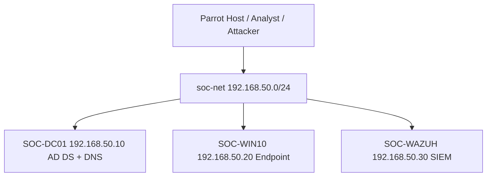

# SOC Lab Topology

```mermaid
flowchart TD
    P["Parrot Host / Analyst / Attacker"] --> N["soc-net 192.168.50.0/24"]
    N --> D["SOC-DC01 192.168.50.10 AD DS + DNS"]
    N --> W["SOC-WIN10 192.168.50.20 Endpoint"]
    N --> Z["SOC-WAZUH 192.168.50.30 SIEM"]
```

The lab uses a dedicated libvirt NAT network named `soc-net`.
