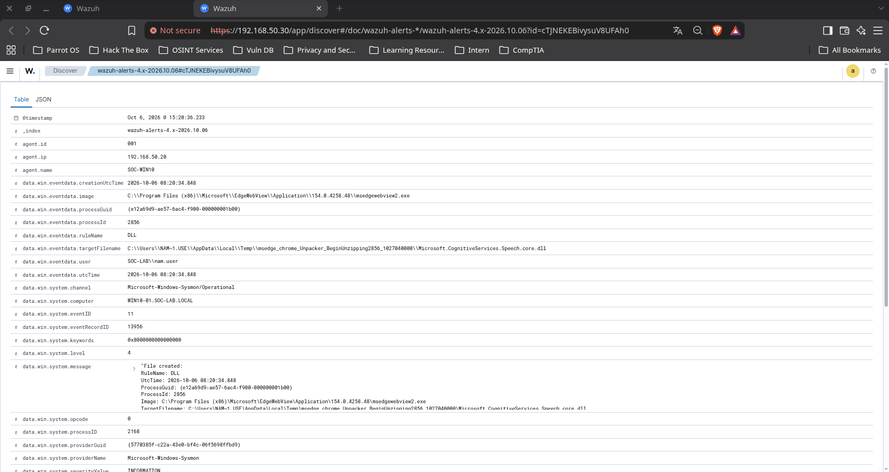
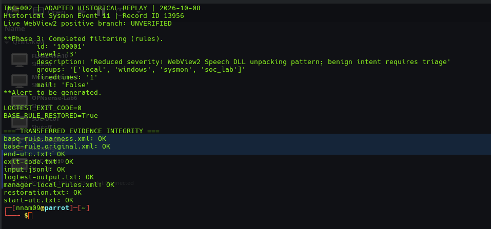

# INC-002 — WebView2 Alert Triage and Scoped Severity Tuning

## Outcome

Historical telemetry supports a likely benign WebView2 unpacking event.
The original severity reduction was too broad: a PowerShell-created file
containing msedgewebview2.exe in its filename received rule 100001 at
level 3.

Rule 100001 was narrowed and deployed. Live before/after tests confirmed
that both PowerShell-created test files now retain rule 92213 at level 15.

The intended WebView2 reduction branch has passed PCRE2 predicate tests,
but has not yet been validated through a matching live Wazuh event.

## Historical Alert

- Alert ID: 1791274836.2534914
- Rule: 92213, level 15
- Wazuh timestamp: 2026-10-06T08:20:36.233+0000
- Endpoint system timestamp: 2026-10-06T08:20:34.8557162Z
- Sysmon Event ID: 11
- Event Record ID: 13956
- Agent: 001 / SOC-WIN10, 192.168.50.20
- Observed hostname: WIN10-01.SOC-LAB.LOCAL
- Account: SOC-LAB\nam.user
- File creator PID: 2856
- ProcessGuid: {e12a69d9-ae57-6ac4-f900-000000001b00}

The file-creating image was:

    C:\Program Files (x86)\Microsoft\EdgeWebView\Application\154.0.4258.48\msedgewebview2.exe

The created file was:

    C:\Users\NAM~1.USE\AppData\Local\Temp\msedge_chrome_Unpacker_BeginUnzipping2856_1027040000\Microsoft.CognitiveServices.Speech.core.dll

Event 11 identifies the file creator, not its parent process.

## Correlation and Assessment

Sysmon Event 1, Record ID 13722, contains the same ProcessGuid and PID.
It identifies M365Copilot.exe as the parent and records WebView2 command
arguments referring to M365Copilot and an OfficeHub WebView data directory.

A subsequent check of the installed WebView2 executable found:

- SHA-256 matching the historical process creation event;
- a Valid Authenticode signature;
- Microsoft Corporation as the signer.

Executable SHA-256:

    8454A3B710D8A8A7002AF5F16349FE6214DF14CEC90A2008E4790BF5728C4A3B

Assessment: likely benign application unpacking activity.

The filename and directory alone do not establish benign intent.
The executable signature check does not verify the created DLL, exclude
process injection, or establish that every matching future event is benign.

## Detection Change

The previous rule used a whole-event match for msedgewebview2.exe.
The live baseline demonstrated that this text could occur in a target
filename even when PowerShell was the actual file creator.

The deployed child of rule 92213 retains level 3 and now requires both:

- the expected versioned WebView2 executable path;
- the specific Speech DLL in a WebView2 unpacking directory.

The description states that benign intent requires triage.
These are path predicates; the rule does not verify signatures or ancestry.

Only rule 100001 was replaced in the manager configuration.
The Wazuh configuration test completed successfully, the manager was
restarted, and agent 001 was Active.

## Live Before/After Validation

Both exercises used WIN10-01\localadmin and PowerShell PID 756.
The files contained harmless plain text and were not executed.

| Test file suffix | Before rule / level | After rule / level |
|---|---|---|
| msedgewebview2.exe.dll | 100001 / 3 | 92213 / 15 |
| control.dll | 92213 / 15 | 92213 / 15 |

Baseline marker: SOC-INC002-BASELINE-20261007T052657Z

After marker: SOC-INC002-AFTER-20261007T053411Z

Baseline Event Record IDs: 17271 and 17272.
After Event Record IDs: 17276 and 17277.

Matching events were retained from both archives.json and alerts.json.
These are two storage representations of the endpoint events, not four
independent file creations.

Result: PASS for preserving severity in the tested PowerShell cases.

## Predicate Tests and Remaining Validation

Eight PCRE2 tests passed: the historical field values, single-backslash
paths, uppercase paths, and five nonmatching path/process cases.

Predicate tests do not validate Wazuh rule hierarchy or alert selection.
A live matching WebView2 event is still required to verify the intended
level 3 branch. No measured reduction in operational alert volume is claimed.

## Evidence

Artifacts are stored in [evidence](evidence/), including:

- original alert and archive JSONL lines;
- correlated process creation evidence;
- executable signature check;
- manager configuration snapshots;
- PCRE2 predicate results;
- live baseline and after-test execution records and logs.

Historical JSONL exports preserve the selected source-line bytes.
Transferred historical records and live log files matched source hashes.
The after-test Windows execution record also matched its source hash.

This review is separate from SOC-INC-001 and does not establish a compromise.

## Follow-up Live Observation

On 2026-10-07, opening Microsoft 365 Copilot displayed a connection error.
A Windows query covering the preceding 30 minutes returned nine WebView2
Sysmon Event 1 records and no WebView2 Event 11 records.

Event 1, Record ID 17302, was also found in Wazuh archives with matching
ProcessGuid {e12a69d9-dcbc-6ac5-e001-000000001f00}.
This confirms collection of that process creation event.

The observed WebView2 version was 154.0.4258.53. The displayed process
events ran under SOC-LAB\nam.user, while the inspection console ran under
WIN10-01\localadmin.

This attempt did not provide a matching file creation event.
The intended level 3 branch therefore remains unverified by live telemetry.
The previously verified PowerShell before/after results remain valid.

## Historical Telemetry Screenshot

The screenshot shows Sysmon Event 11, Record ID 13956, PID 2856,
and the WebView2 Speech DLL target path. Rule ID and alert severity
are not visible in this capture. Preserved JSON remains primary evidence.
This is historical telemetry, not post-deployment validation.

## Adapted Historical Replay — 2026-10-08

Historical Sysmon Event 11, Record ID 13956, was replayed using the
full_log string extracted from the preserved archive record.
Input SHA-256:
`cba3ff4dd2a4b1081714ce78694df8b2959d8f76ca9d159ab0a74ff0f94fb18b`.

The initial unmodified logtest run decoded the input as JSON but did not
reach Phase 3. Exit code 0 alone was not treated as a successful rule test.

For the adapted test harness, rule 60000 temporarily had its ossec
category removed and its decoded_as changed from windows_eventchannel
to json. Rule 100001 was unchanged. Logtest selected rule 100001 at
level 3.

The original base-rule bytes were restored after the test.
The subsequent configuration test returned 0 and the manager was active.
The manager was not restarted during the harness exercise.
Transferred evidence passed all stored SHA-256 manifest checks.

This is a positive adapted historical replay, not live EventChannel
ingestion validation. The live WebView2 positive branch remains unverified.
Earlier live PowerShell negative-control results remain separate evidence.

[Replay evidence](evidence/historical-replay-20261008/)

