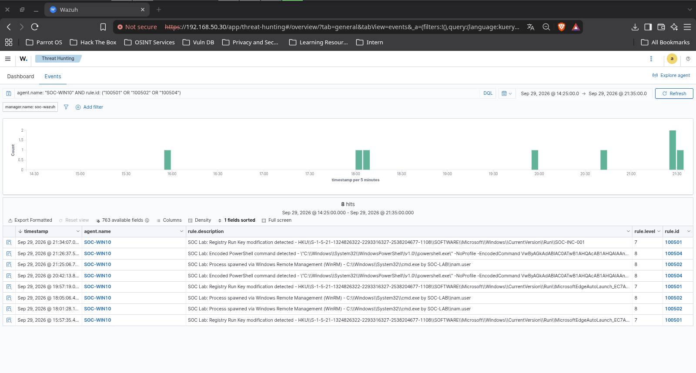
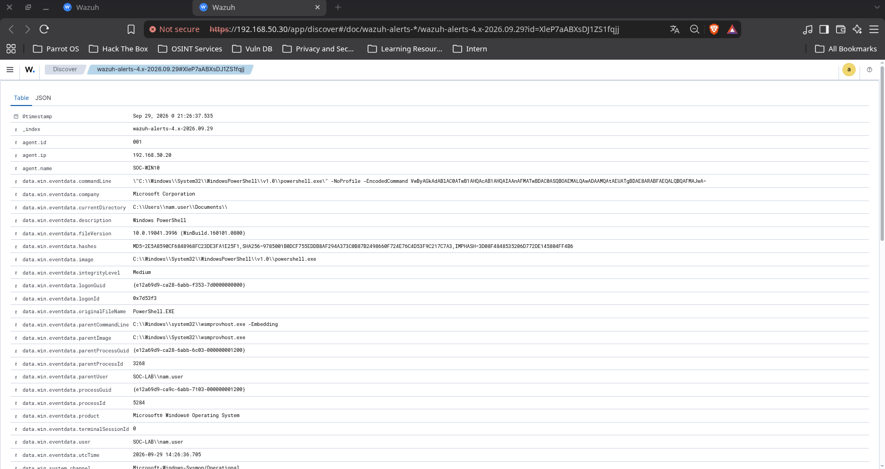
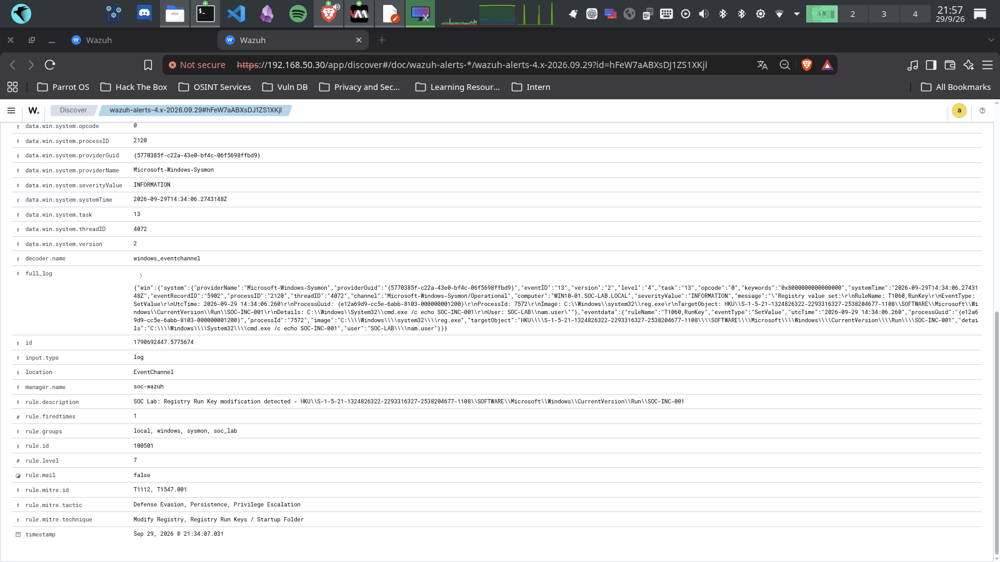

# SOC-INC-001 — Controlled Windows Endpoint Incident Simulation

## Status

Controlled lab simulation.

## Scope

- Endpoint: SOC-WIN10
- Domain: SOC-LAB.LOCAL
- SIEM: Wazuh
- Telemetry: Windows Security Logs + Sysmon
- Incident ID: SOC-INC-001

## Objective

Demonstrate an end-to-end SOC workflow from endpoint activity through
telemetry collection, detection, triage, correlation, and incident analysis.

## Detection Coverage

| Rule ID | Detection | MITRE ATT&CK |
|---|---|---|
| 100501 | Registry Run Key modification | T1112 / T1547.001 |
| 100502 | WinRM process execution | T1021.006 |
| 100503 | Repeated Windows failed logons | T1110 |
| 100504 | Encoded PowerShell | T1059.001 |
| 100505 | PowerShell network connection | T1095 |

## Evidence Integrity Note

SOC-INC-001 is a controlled lab simulation.

Previously generated alerts are validation evidence for individual detection
rules and must not be represented as a single real-world attack chain.

The final incident timeline will distinguish observed telemetry from analyst
interpretation.

## Incident Evidence

### Alert Timeline

The incident window correlates three observed custom detections on SOC-WIN10:

- 100502 — WinRM process execution
- 100504 — Encoded PowerShell execution
- 100501 — Registry Run Key modification

### Encoded PowerShell Process Evidence

The event detail shows PowerShell executing under the WinRM process context,
including `wsmprovhost.exe` as the parent process and the
`-EncodedCommand` command-line argument.

### Registry Persistence Evidence

Sysmon Event ID 13 and Wazuh rule 100501 record modification of:

    HKU\<USER-SID>\SOFTWARE\Microsoft\Windows\CurrentVersion\Run\SOC-INC-001

by `reg.exe` under `SOC-LAB\nam.user`.

## Investigation Documents

- [Incident timeline](timeline.md)
- [SOC analyst investigation](analysis.md)

## Final Assessment

SOC-INC-001 demonstrates an end-to-end controlled SOC investigation covering:

    Activity Generation
            |
            v
    Sysmon Telemetry
            |
            v
    Wazuh Collection
            |
            v
    Custom Detection
            |
            v
    Alert Triage
            |
            v
    Event Correlation
            |
            v
    Incident Analysis

Only telemetry actually observed by Sysmon and Wazuh is treated as confirmed
incident evidence.

The network activity attempted during the simulation was excluded from the
confirmed timeline because the expected Sysmon Event ID 3 was not observed
for the incident PowerShell process.

## Response Exercises and Current Status

- [Capstone report and evidence boundaries](capstone-report.md)
- [Verified process containment replay](response-replay.md)
- [AD account containment and restoration](account-response.md)
- [Live detection baseline](../../detections/wazuh/tests/encoded-powershell/README.md)

The October response exercises are separate from the September simulation.
Full incident closure and new tuning with before/after regression remain open.
