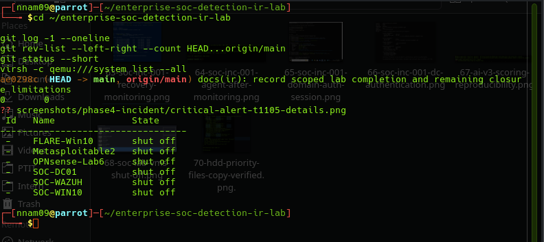

# SOC-INC-001 — Lab Completion and Closure Assessment

## Decision

The documented investigation and response exercises are complete within
their stated educational scope. Full incident lifecycle closure remains
open. No real compromise or fully clean endpoint is asserted.

## Verified Work

- Original controlled observations: WinRM execution, encoded PowerShell,
  and Registry Run Key modification.
- Separate process containment replay with post-action absence checks.
- Separate AD account disable and restoration with DC audit evidence.
- Run Key absence under the original user SID.
- Eleven sampled checks over approximately five minutes fourteen seconds.
- Post-restoration domain authentication and target-identity process creation.
- October 8 desktop session under the target SID, successful DC Kerberos
  authentication, and profile file creation/readback.
- Four live encoded PowerShell validation tests.

The October response exercises are separate from the September simulation.

## Accepted Evidence Limitations

- Historical Run Key deletion time and actor remain unverified.
- Sampled monitoring does not prove continuous absence.
- Sysmon Event 5 process termination evidence remains unverified.
- Existing session revocation and recovery of all applications remain
  unverified. October 8 desktop and profile file checks passed within
  their documented scope.

## Separate Follow-up Work

INC-002 has verified live before/after results for the PowerShell file
creation cases. Its intended WebView2 level 3 branch remains unverified
through matching live telemetry.

DFIR-001 is a separate controlled evidence review. Isolation Forest v3
scoring was reproduced; the single encoded test event was not flagged.
These results do not establish operational detection effectiveness.

## Preservation Status

Repository documentation and evidence are published in Git.
A standalone backup of the three SOC VM disks has not been completed.

External HDD filesystem errors interrupted the VM backup preparation.
Approximately 9 GB of selected existing HDD files were copied to the host
SSD and compared with the source using rsync checksums, with no reported
differences or errors. This was a partial data rescue, not a VM backup.
The temporary SSD rescue directory was subsequently deleted at the
user's request on 2026-10-07; that rescue copy is no longer retained.

The external HDD was unmounted. All lab VMs were shut off at the final
reported check. Original VM disks and backing files must be retained.

## References

- [Capstone report](capstone-report.md)
- [Recovery verification](recovery-verification.md)
- [Process response replay](response-replay.md)
- [Account response](account-response.md)

## Supporting Final Status Screenshot

The screenshot records repository synchronization and powered-off VMs
at commit ae0298c, before this screenshot documentation was committed.
It does not establish completion of a VM disk backup.

