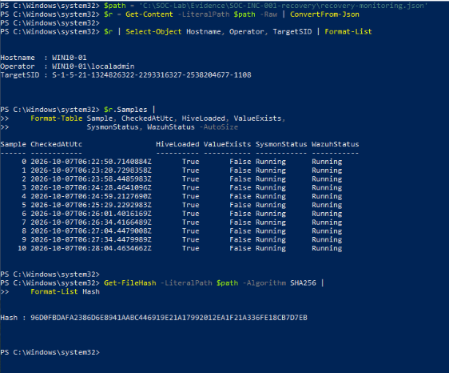
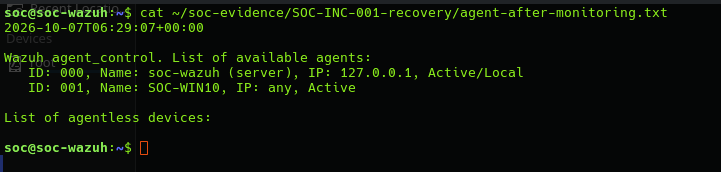
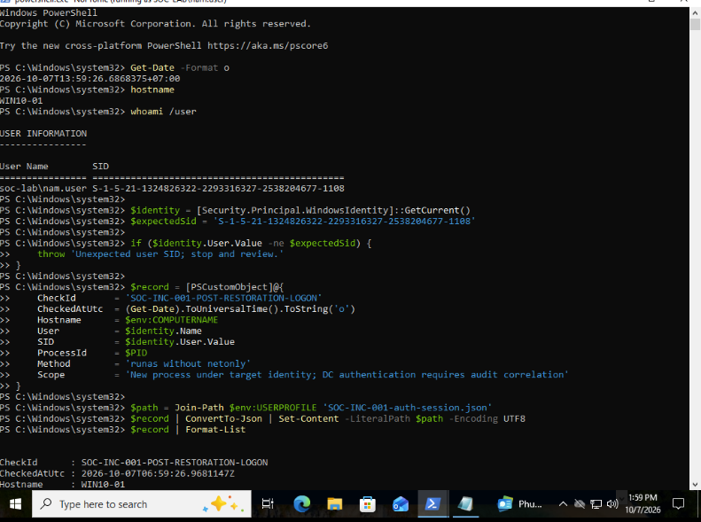
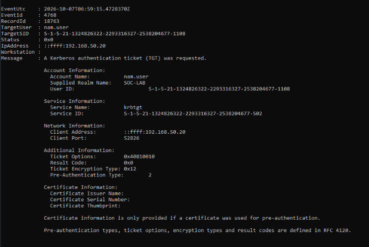

# SOC-INC-001 — Run Key Current-State Verification

## Result

On 2026-10-07T05:51:59.2292509Z, the analyst verified that the
SOC-INC-001 value was absent from the loaded nam.user Registry Run key.

This establishes the current state of the specific value.
It does not establish when it was deleted, who deleted it, or whether
it remained absent throughout the period since the original simulation.

## Scope

- Observed hostname: WIN10-01
- Inspection operator: WIN10-01\localadmin
- Target account profile: C:\Users\nam.user
- Target SID: S-1-5-21-1324826322-2293316327-2538204677-1108
- Target hive: loaded
- Run key: present
- Value name: SOC-INC-001
- Value present: False

The inspection used the target SID under HKEY_USERS rather than
the inspection operator's HKCU.

## Evidence

- [Current-state record](evidence/recovery/runkey-current-state.json)
- [SHA-256 manifest](evidence/recovery/SHA256SUMS.txt)

The transferred record matched its Windows source SHA-256:

    8223418f591de696e965c817275068f444506c3aa46e499719e20f9231203258

## Limitations

No registry modification was performed during this check.
Historical deletion telemetry remains unverified.
Other persistence locations and sustained recurrence monitoring were
not assessed by this check. Full incident closure remains open.

## Sampled Follow-up Monitoring

Eleven samples were collected from 2026-10-07T06:22:50.7140884Z
through 2026-10-07T06:28:04.4634662Z, spanning approximately
5 minutes 14 seconds.

At every sample:

- the target user hive was loaded;
- the Run key existed;
- the SOC-INC-001 value was absent;
- Sysmon64 and WazuhSvc were Running.

The requested sleep interval was 30 seconds. Actual sample timestamps
include processing and scheduling delays.

A subsequent manager-side check reported agent 001 / SOC-WIN10 as Active.
The captured UTC timestamp, 2026-10-07T06:29:07+00:00, preceded
execution of the agent status command.

Evidence:

- [Monitoring samples](evidence/recovery/recovery-monitoring.json)
- [Subsequent agent status](evidence/recovery/agent-after-monitoring.txt)

The monitoring record matched its Windows source SHA-256 after transfer.
These checks establish sampled absence and service status only.
Changes between samples and other persistence mechanisms remain unverified.
Post-restoration domain authentication was assessed in the separate check below.

## Supporting Screenshots

These screenshots support presentation of the recovery checks.
The JSON samples and captured agent output remain the primary evidence.

## Post-restoration Domain Authentication

On 2026-10-07, the analyst used runas without /netonly to start a new
PowerShell process as SOC-LAB\nam.user on WIN10-01.

The attempt began at 06:59:04.1087133 UTC. DC01 Security Event 4768,
Record ID 18763, recorded a successful Kerberos TGT request at
06:59:15.4728370 UTC for the target account SID, with Status 0x0
and client address ::ffff:192.168.50.20.

At 06:59:26.9681147 UTC, the new PowerShell process, PID 2536,
reported SOC-LAB\nam.user and the expected SID:
S-1-5-21-1324826322-2293316327-2538204677-1108.

Together, the DC audit event and new process identity support successful
domain authentication and process creation after account restoration.

Result: PASS for post-restoration domain authentication and creation
of a process under the target identity.

This check does not establish revocation of earlier sessions, successful
desktop sign-in, or recovery of all applications. Endpoint Event 4624
has not yet been incorporated into this evidence set.

Evidence is stored in evidence/recovery/authentication/.
Both transferred artifacts matched their source SHA-256 values.

### Authentication Supporting Screenshots

The JSON session record and DC event XML remain the primary evidence.

